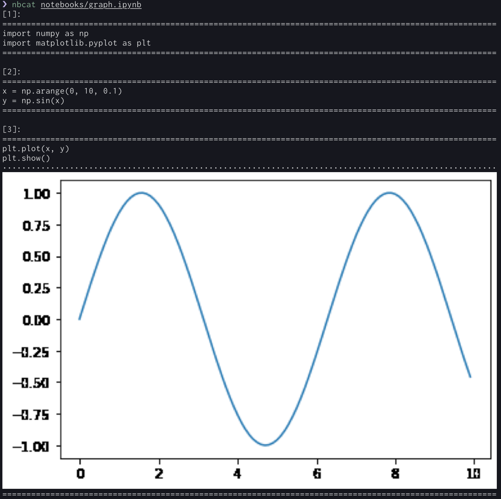

<h1 align="center">Welcome to nbcat 👋</h1>
<p>
  
  <a href="https://twitter.com/moisutsu" target="_blank">
    
  </a>
</p>

> A command-line tool that displays .ipynb file like `cat` command.

## Install

```sh
cargo install nbcat
```

## Usage

You can view the .ipynb file on the terminal by simply passing the path, as in the `cat` command.

```sh
nbcat <file-name>
```

Even notebooks that include graphs can be displayed.



## Author

👤 **moisutsu**

* Twitter: [@moisutsu](https://twitter.com/moisutsu)
* Github: [@moisutsu](https://github.com/moisutsu)

## Show your support

Give a ⭐️ if this project helped you!

***
_This README was generated with ❤️ by [readme-md-generator](https://github.com/kefranabg/readme-md-generator)_
